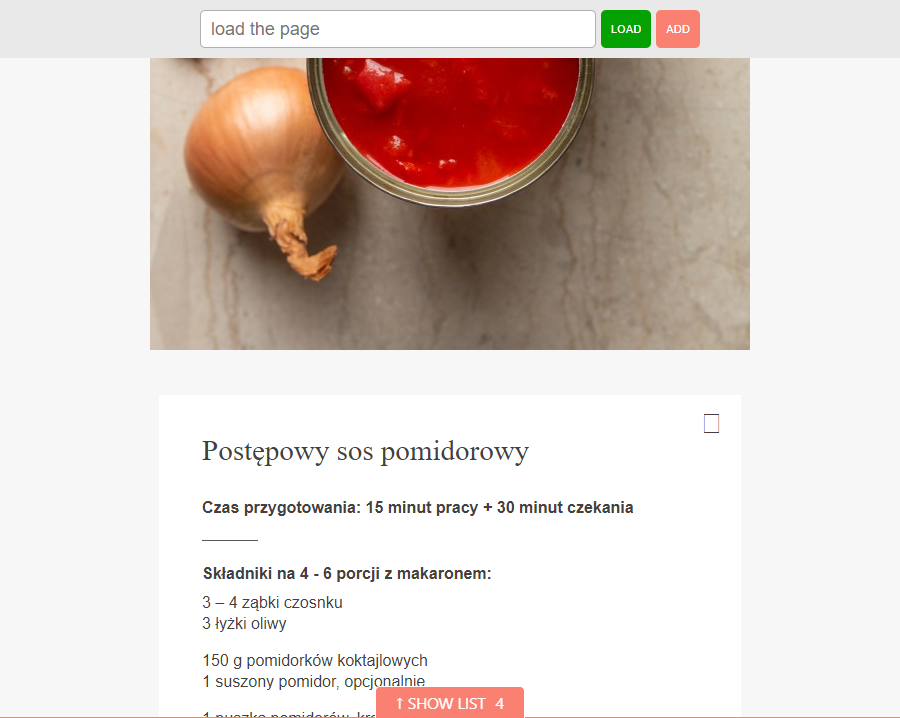

# Prevent display sleep while cooking ;)
Has it ever happened that you open a recipe and start cooking and every now and then look at the phone / table or laptop to make sure that you do everything according to the recipe? If the answer is yes, you probably got irritated by the constant waking up of the device.

This simple example is based on the [API WakeLock](https://developer.mozilla.org/en-US/docs/Web/API/Screen_Wake_Lock_API) to prevent this from happening.

## How this example works
We have a field in which we paste our url, click the "LOAD" button and our page is loaded into the iframe. There is also an "ADD" button next to the "LOAD" button. Pressing it causes adding our addresses to the localStorage. To view this list, at the bottom of the page there is a button "↑ SHOW LIST X", clicking on it causes the appearance of this list with our recipes saved, which we can also remove from our list here.

Clicking on the link here will load our remembered page.
It should be remembered that the page does not turn off the device, which means that energy from the device is constantly being consumed. If you are done cooking close this page.

Note: The WakeLock API does not work on all browsers. You can change it using the library [NoSleep.js](https://github.com/richtr/NoSleep.js/)

<p align="center">
  
</p>

## Below is information for developers
Unfortunately, just doing an iframe doesn't always happen, as many sites are prohibited from downloading to an iframe - [CORS](https://developer.mozilla.org/en-US/docs/Web/HTTP/CORS). I got around this by using php to be exact [CURL](https://www.php.net/manual/en/book.curl.php)


## The first thing
Install the Docker manual can be found here ->
[Docker](https://www.docker.com/get-started).
Linux users must also install Docker Compose separately.

## Initialization

Before the first use, clone this repository and install node dependencies:

```
yarn
``` 
or 
```
npm install
```

### How to run the php code
```
yarn dev
```
or 
```
yarn prod
```

After calling the command `yarn dev` it should open the page http://localhost:8080